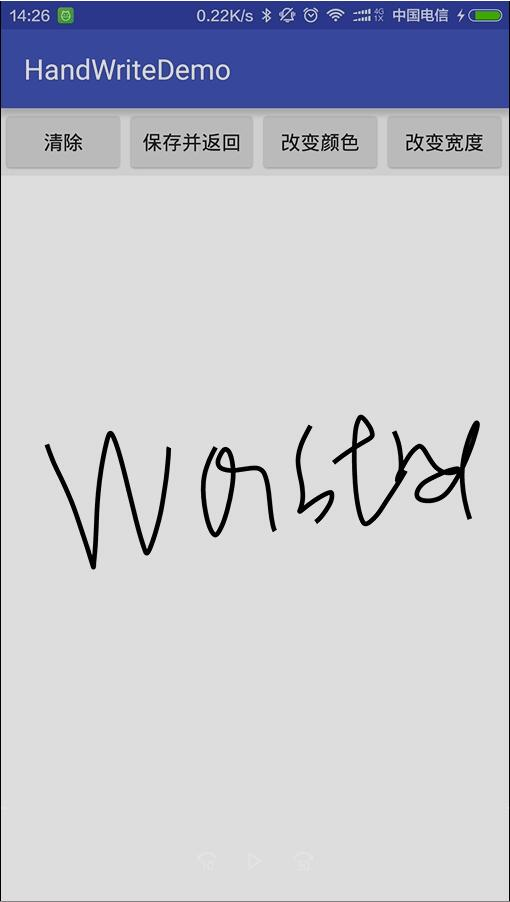

（安卓电子签名简介）E-signature for Android
============================
* 支持签名边缘裁剪
* 根据速度进行了插值改变宽度。


[](https://jitpack.io/#venusic/E-signature)
```
	allprojects {
		repositories {
			...
			maven { url 'https://jitpack.io' }
		}
	}
	
	dependencies {
    	        compile 'com.github.venusic:E-signature:${last_version}'
    	}
```
### 使用
- 添加View

```
     <com.wastrel.handwrite.view.HandWriteView
               android:id="@+id/view"
               android:layout_width="match_parent"
               app:paintMaxWidth="20px" //最大宽度
               app:paintMinWidth="10px" //最小宽度
               app:paintColor="#FF0000" //颜色
               android:layout_height="match_parent"/>
```
- 保存
 

```
if (view.isSign()) {
    try {
        view.save(MainActivity.path1, true, 10);
    } catch (IOException e) {
        e.printStackTrace();
    }
} else {
    Toast.makeText(context, "您没有签名~", Toast.LENGTH_SHORT).show();
}

```

 
- 清除

```
view.clear();
```
- 修改背景、笔宽、颜色

```
    //最小宽度、最大宽度
  view.setPaintWidth(10,20);
  view.setPaintColor(Color.WHITE);
  view.clear();
```
  
###效果图




  
