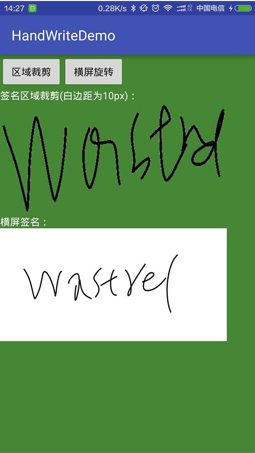

（安卓电子签名简介）E-signature for Android
============================
* 支持签名边缘裁剪
* 支持去除背景色
* 支持前景颜色或背景颜色修改

###如何使用
* 下载项目
* 将项目中的LinePathView.java拷贝到你的工程里
* 在layout中布局:

	```xml
    <com.example.ksi_android.handwritedemo.LinePathView
        android:layout_width="match_parent"
        android:layout_height="match_parent"
        android:id="@+id/view"
        android:layout_gravity="center_horizontal" />
	```
*  对保存按钮和清除按钮设置相应的监听

   ```java
    mSave.setOnClickListener(v -> {
            if (view.getTouched()) {
            	//参数分别是保存路径、是否删除边缘空白、边缘保留多少空白（int:>0）、是否设置背景为透明、比较颜色容差值（double：0~1）
                view.save(MainActivity.path, true, 10, true, 0.9);
                setResult(100);
                finish();
            } else {
                Toast.makeText(HandWriteActivity.this, "您没有签名~", Toast.LENGTH_SHORT).show();
            }
        });
        mClear.setOnClickListener(v -> view.clear());
   ```
   
*  设置颜色等功能请看源码注释
  
###效果图
* 白底黑字笔粗10px


* 红底白字笔粗20px


* 结果预览 上方为剪切边缘并去除背景色的结果 下方为横屏不处理结果


  
